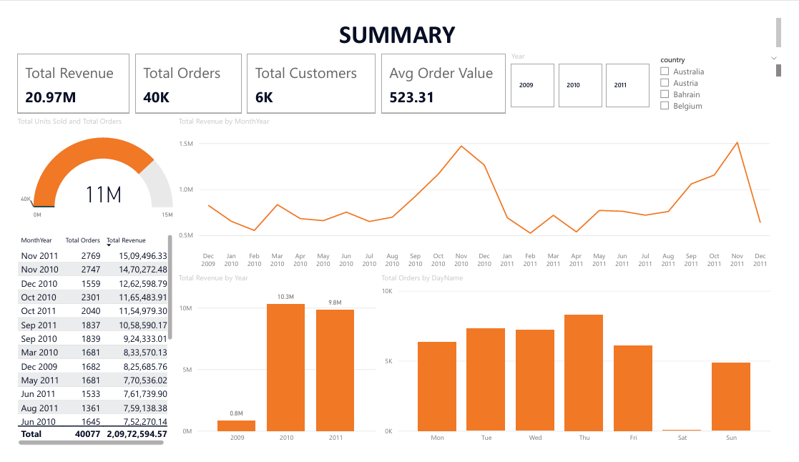

# UK E-Commerce Sales Analysis

End-to-end sales analysis of 1M+ UK retail transactions using
PostgreSQL (intermediate SQL) and Power BI.

## Project overview
Analysed two years of transactional data from a UK-based online
retailer to identify revenue trends, top products, international
markets and customer segments using RFM analysis.

## Dashboard pages

### Page 1 — Executive Summary
- KPI cards: £20.97M revenue, 40K orders, 6K customers, £523 avg order value
- Monthly revenue trend showing clear November seasonal peaks
- Revenue comparison across 2009, 2010 and 2011
- Order volume by day of week — Thursday is the busiest day

### Page 2 — Product Analysis
- Top 10 products by revenue — Regency Cakestand 3 Tier leads at £0.34M
- Revenue by country — UK dominates, EIRE and Netherlands are top international markets
- Dynamic avg order value by country — Netherlands highest at £2.4K
- Units sold vs revenue scatter plot identifying high-value vs high-volume products

### Page 3 — Customer Segments (RFM Analysis)
- 5,878 customers segmented into Champions (227), Loyal (2K), At Risk (3K), Lost (1K)
- Key finding: Lost customers have the highest avg spend at £7,309 — win-back
  campaign opportunity
- RFM scatter plot showing frequency vs monetary value per customer
- Avg monetary value by segment

## Key findings
- Revenue peaks every November driven by seasonal gifting demand
- Netherlands and Singapore have the highest average order values internationally
- 227 Champion customers drive disproportionate revenue
- Lost customers (1,470) had avg spend of £7,309 — highest of all segments
- Thursday is the busiest trading day — lowest activity on weekends confirming B2B nature

## Tools used
- PostgreSQL — data storage and intermediate SQL queries
- SQL — window functions, CTEs, NTILE(), RFM segmentation
- Python — data cleaning and loading (Pandas, SQLAlchemy)
- Power BI Desktop — dashboard and DAX measures
- DAX — SUMX, DISTINCTCOUNT, SELECTEDVALUE, DIVIDE
- Power Query — custom date columns, data transformation
- GitHub — version control and portfolio hosting

## SQL techniques used
- CTEs (Common Table Expressions)
- Window functions (LAG, RANK, NTILE)
- DATE_TRUNC for time series aggregation
- RFM customer segmentation with NTILE quartiles
- Subqueries and multi-step aggregations

## How to run
1. Clone the repo
2. Run `pip install -r requirements.txt`
3. Run `01_load_data.ipynb` to clean the raw CSV
4. Run `02_load_to_postgres.ipynb` to push data to PostgreSQL
5. Open `powerbi/uk_ecommerce_dashboard.pbix` in Power BI Desktop
6. Update the PostgreSQL connection to your local credentials

## Dataset
UCI Online Retail II dataset — available free on Kaggle
500K+ transactions from a UK-based online retailer (2009–2011)

## Screenshots
## Screenshots

